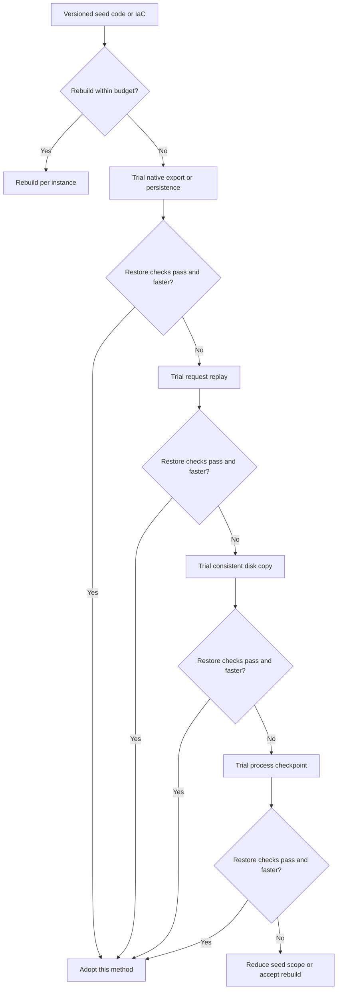
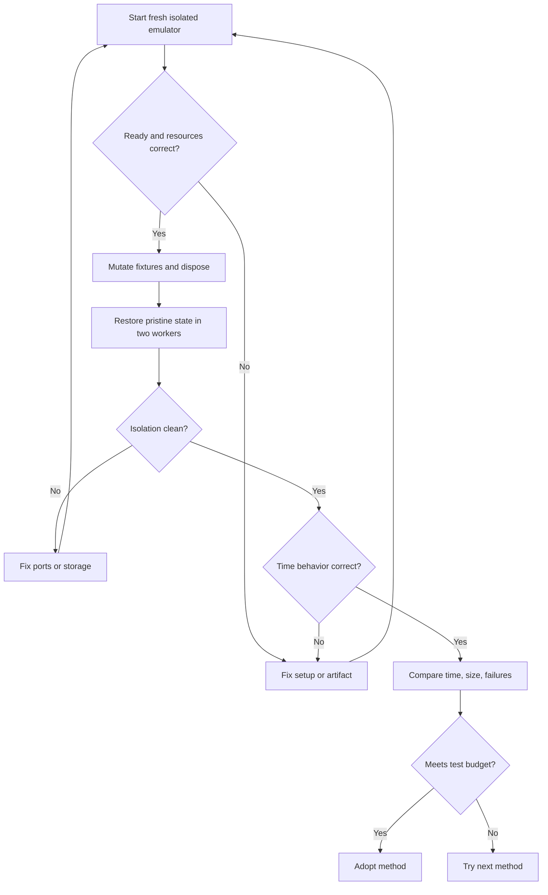

# Reusable cloud emulator baselines and snapshots

[Back to the selection guide](selection-guide.md#reusable-emulator-baselines)

Use this workflow to prepare a repeatable starting state for tests or research with a single-service emulator or a broader cloud API suite. Start with versioned setup, then prefer the emulator's own export or persistence feature when rebuilding is slow. **The checkpoint combinations here have not been tested with particular emulators; verify them on your CI hosts before adoption.** Documentation reviewed on **2026-09-28**: Moto [stable 5.2.3](https://docs.getmoto.org/en/stable/docs/configuration/recorder/index.html), and the linked current Firebase, LocalStack, Azurite, DynamoDB Local, Podman, CRIU, and Docker documentation. Pin and record actual tool versions in each baseline; unversioned documentation can change.

## Choose what to preserve

Measure the complete rebuild time first. If it exceeds your test budget, try methods in this order and keep the versioned seed as a fallback. A method is useful only if it passes the [restore acceptance sequence](#restore-and-prove-isolation) and improves total time or reliability.



Skip methods your emulator does not support. Include any volumes and external dependencies required for a consistent restore.

| Method | What it preserves | When to consider it | Boundary |
| --- | --- | --- | --- |
| Declarative setup or seed code | Instructions and fixture data | The default for portable, reviewable baselines | Must reapply; unsupported API operations may require another setup path. |
| Emulator-native export or persistence | State in an emulator-supported format or data directory | Firebase export/import, LocalStack snapshots, Azurite location, DynamoDB Local database | Coverage, version compatibility, licensing, and per-worker isolation vary by product. |
| Request recording and replay | Calls used to build a baseline | The emulator or client supports repeatable recording | Replays calls, not process state; generated IDs and ordering may need explicit handling. |
| Persisted-state copy | Files or volumes used by the emulator | State is documented as durable and can be captured consistently | Does not capture in-memory state or external dependencies. |
| Process or container checkpoint | Running process state, subject to tool support | Rebuilding is costly and the runner supports checkpoint/restore | Host, runtime, filesystem, network, and dependency compatibility require validation. |

Native options to check first:

- [Firebase Local Emulator Suite](https://firebase.google.com/docs/emulator-suite/install_and_configure): `firebase emulators:export`, `--import`, and `--export-on-exit` for supported data emulators (Authentication, Firestore, Realtime Database, and Cloud Storage); these flags do not export every emulator in the suite.
- [LocalStack](https://docs.localstack.cloud/aws/capabilities/state-management/): persistence (`--persist` or `PERSISTENCE=1`) and local snapshots (`lstk snapshot save/load`); [Cloud Pods](https://docs.localstack.cloud/aws/developer-tools/snapshots/cloud-pods/) share versioned snapshots. The current documentation lists these snapshot features under **Base and Ultimate** plans, with a user license/auth token required for access; check your current plan and terms before CI use.
- [Azurite](https://learn.microsoft.com/en-us/azure/storage/common/storage-install-azurite): `--location` chooses the persisted data directory; stop the process before copying it.
- [DynamoDB Local](https://docs.aws.amazon.com/amazondynamodb/latest/developerguide/DynamoDBLocal.UsageNotes.html): `-dbPath` chooses the database directory, and `-sharedDb` uses one database file. `-inMemory` does not persist state.

Checkpoint tools include [CRIU](https://github.com/checkpoint-restore/criu) for Linux processes and [Podman checkpoint/restore](https://podman.io/docs/checkpoint) for containers. [DMTCP](https://github.com/dmtcp/dmtcp) is a separate application-level approach; it requires launching the workload under its control. Docker's [checkpoint/restore](https://docs.docker.com/reference/cli/docker/checkpoint) uses CRIU and is experimental.

[Docker commit](https://docs.docker.com/reference/cli/docker/container/commit) captures container filesystem changes, not process memory or mounted-volume data. Use an image commit for a prepared runtime or files, not as a live-state snapshot. For a disk-backed emulator, confirm which paths hold state and how to stop or quiesce writes before copying them.

## Prepare and capture

1. **Define a baseline contract.** List the emulator version, supported API operations, accounts or projects, regions, resources, and synthetic data required.
2. **Make setup reproducible.** Keep SDK seed code or IaC in version control, pin client and provider versions, route calls explicitly to local endpoints, and use dummy credentials. Before any write, check the configured endpoint and query identity from that endpoint. For example, with Moto ServerMode, use `aws --endpoint-url http://127.0.0.1:5000 sts get-caller-identity` and require account `123456789012` (unless you configured a different Moto account); abort on any mismatch. Keep IaC state files consistent with the baseline; they track managed resources but do not necessarily contain the emulator's live state.
3. **Prepare a clean instance.** Apply setup, then assert resource inventory and representative reads.
4. **Record requests when using replay.** Start before the first setup request, stop after the last, and save the log. Check IDs, timestamps, ordering, and non-idempotent operations on a fresh replay. For Moto, place the seed request immediately after recording starts so replay seeds the fresh server too.
5. **Quiesce for capture.** Finish requests, stop test clients, and make writes consistent. For process checkpoints, reconnect clients after restore instead of assuming existing sessions survive. Decide how pending work and time-sensitive fixtures should behave.
6. **Capture a complete artifact set.** Record what the method includes and excludes: process memory, root filesystem, volumes, bind mounts, request logs, and external services. Podman documents [checkpoint export](https://docs.podman.io/en/latest/markdown/podman-container-checkpoint.1.html) and [restore import](https://docs.podman.io/en/latest/markdown/podman-container-restore.1.html), with options affecting filesystem and volume inclusion. Inspect the artifact rather than assuming it contains all state.
7. **Record the environment.** Store emulator image digest or version, baseline revision, architecture, OS/kernel, CPU model and feature flags, runtime and checkpoint-tool versions where applicable, network assumptions, and checksums. Protect artifacts that may contain process memory, credentials, or test data.

## Restore and prove isolation

Run this acceptance sequence on the actual CI runner class for each candidate method:



1. Start a fresh emulator and rebuild or replay the baseline, or restore a fresh instance from its captured state. Allocate isolated ports, identities, and writable storage per test worker.
2. Wait for readiness, reconnect clients, and compare resource inventory and representative payloads with the baseline contract.
3. Mutate and delete fixtures, run a test, and dispose of the instance and its mutable state.
4. Restore the original baseline again and assert that the prior mutations are absent. Repeat with two workers to find shared-volume or port collisions. For repeated Podman imports, use `podman container restore --import checkpoint.tar.gz --name <unique-worker-name>` and assign distinct published ports; use `--ignore-static-ip` or `--ignore-static-mac` when static addresses would collide.
5. Test time-dependent behavior your suite relies on, such as expiry, scheduled events, or delayed processing. A process snapshot does not guarantee identical wall-clock behavior.
6. Compare complete rebuild/replay time with restore-and-readiness time, artifact size, and failure rate. Rebuild artifacts when the baseline or execution environment changes.

Application assertions determine whether the restore worked; a health response alone is insufficient. Keep real-cloud tests for semantics the emulator does not model.

## Platform and consistency boundaries

CRIU is Linux-specific. [Podman's documented checkpoint/restore workflow requires rootful Podman](https://github.com/podman-container-tools/podman/blob/main/rootless.md); plan a suitable Linux runner and permissions. Verify kernel features, security settings, and container runtime support on the host running the emulator. Docker Desktop on macOS/Windows is not equivalent to a compatible Linux host. [CPU instruction features](https://criu.org/Cpuinfo) can differ even within a hosted CI runner pool and break restore; compare capture and restore hosts or constrain the pool. Review CRIU's handling of [TCP connections](https://criu.org/TCP_connection), file locks, storage, and namespaces. Recreate or restore external dependencies consistently.

For DMTCP, launch the process under its control from the start; see its [quick start](https://github.com/dmtcp/dmtcp/blob/main/QUICK-START.md). Application and container checkpointing have different integration requirements. A local landing-zone fixture models only the resources and behaviors the emulator supports. Keep real-cloud tests for policy enforcement, networking, and other properties outside that model.

## Example: Moto server request replay

[Moto Recorder](https://docs.getmoto.org/en/stable/docs/configuration/recorder/index.html) is built in, supports ServerMode, and is enabled with `MOTO_ENABLE_RECORDING=True`. Its APIs start and stop recording, download or upload the request log, and replay it. Moto documents seeding for repeatable generated IDs; validate dependent requests against the pinned Moto version.

The recorder endpoints are `/moto-api/recorder/start-recording`, `stop-recording`, `download-recording`, `upload-recording`, and `replay-recording`. The seed endpoint is `/moto-api/seed?a=<integer>`. Start recording **before** posting the seed: Moto records the seed request, so replay seeds the fresh server at the same point. Do not seed a second time separately before replay unless you have deliberately removed the recorded seed.

This shell example requires Moto ServerMode, AWS CLI, and curl. It creates an S3 bucket as a tiny baseline; replace that write with your versioned seed script. Run in a disposable directory, and use a separate port for concurrent workers. The endpoint and account guard runs before any AWS write.

```bash
set -euo pipefail
export MOTO_ENABLE_RECORDING=True AWS_ACCESS_KEY_ID=testing
export AWS_SECRET_ACCESS_KEY=testing AWS_DEFAULT_REGION=us-east-1
MOTO_URL=http://127.0.0.1:5000
export MOTO_RECORDER_FILEPATH="$PWD/moto-recording-active"
trap 'kill "$moto_pid" 2>/dev/null || true' EXIT
check_local() {
  for attempt in {1..30}; do
    account=$(aws --endpoint-url "$MOTO_URL" sts get-caller-identity \
      --query Account --output text 2>/dev/null) || true
    if [ "$account" = 123456789012 ]; then return 0; fi
    sleep 0.2
  done
  echo "Moto endpoint/account check failed" >&2; return 1
}
moto_server -H 127.0.0.1 -p 5000 & moto_pid=$!
check_local
curl -fsS -X POST "$MOTO_URL/moto-api/recorder/start-recording"
curl -fsS -X POST "$MOTO_URL/moto-api/seed?a=42"
aws --endpoint-url "$MOTO_URL" s3api create-bucket --bucket baseline-fixture
curl -fsS -X POST "$MOTO_URL/moto-api/recorder/stop-recording"
curl -fsS "$MOTO_URL/moto-api/recorder/download-recording" -o moto-recording.bin
kill "$moto_pid"; wait "$moto_pid" || true
export MOTO_RECORDER_FILEPATH="$PWD/moto-recording-replay"
moto_server -H 127.0.0.1 -p 5000 & moto_pid=$!
check_local
curl -fsS -X POST --data-binary @moto-recording.bin \
  "$MOTO_URL/moto-api/recorder/upload-recording"
curl -fsS -X POST "$MOTO_URL/moto-api/recorder/replay-recording"
aws --endpoint-url "$MOTO_URL" s3api head-bucket --bucket baseline-fixture
kill "$moto_pid"; wait "$moto_pid" || true
```

[Recorder reset](https://docs.getmoto.org/en/stable/docs/configuration/recorder/index.html) clears the log, whereas [server reset](https://docs.getmoto.org/en/stable/docs/server_mode.html#reset-api) clears resource state.

## Example: Azurite persisted directory

For a disk-backed baseline, [Azurite's `--location`](https://learn.microsoft.com/en-us/azure/storage/common/storage-install-azurite) stores emulator data in a chosen directory. Seed it through the local Blob/Queue/Table endpoints, stop Azurite cleanly, then copy the entire directory to a baseline you leave untouched. Each worker gets its own writable copy and unique ports:

```bash
mkdir -p azurite-live
azurite --location "$PWD/azurite-live" & azurite_pid=$!
# Seed fixtures through your Azurite connection string; verify them.
kill "$azurite_pid"; wait "$azurite_pid" || true
cp -a azurite-live azurite-baseline
cp -a azurite-baseline azurite-worker-1
azurite --location "$PWD/azurite-worker-1" \
  --blobPort 11000 --queuePort 11001 --tablePort 11002
```

Do not copy a directory while the emulator is writing. Pin the Azurite version and test that restored fixtures survive restart; a copied directory is useful only if its expected state is observable through the emulator's APIs.
